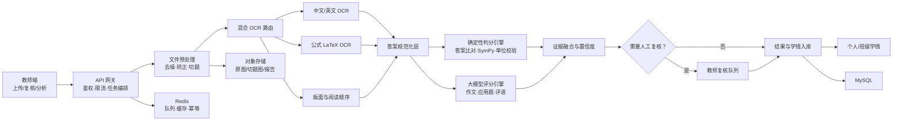

# 智批 AI——AI 智能作业批改系统技术说明文档

> 比赛交付版本：1.0  
> 更新日期：2026-07-18  
> 目标用户：中小学学科教师、教研组长、学校管理者

## 0. 项目摘要

智批 AI 面向“一个班 40 份作业，老师每天重复判分、写评语、做错因汇总”的真实场景。系统把一次批改拆成可追溯的证据链：图像质量检测 → 页面矫正 → 自动切题 → 文字/公式 OCR → 答案结构化 → 规则与符号计算判分 → 大模型主观评分 → 个性化评语 → 知识点画像 → 教师复核。

系统同时支持数学与语文作文：

- 数学：选择/判断直接比对；计算、方程、应用题按步骤识别并给过程分。
- 作文：从内容、结构、语言、书写四维评分，输出证据、扣分原因和修改建议。
- OCR：中文、英文、数学公式混合识别，保留每个文字块的坐标和置信度。
- 学情：将每次错误沉淀为“知识点—错误类型—证据—时间”的学习证据，生成雷达图、薄弱点排行和个性化路径。

核心设计原则是“机器给建议，教师保有最终裁量权”。低置信度、主观题分歧或异常分数自动进入人工复核，不把大模型的自然语言推理当作唯一评分依据。

---

## 1. 系统整体架构设计

### 1.1 逻辑架构



### 1.2 部署架构

- Web 层：React/Next.js（比赛 Demo 使用 vinext，正式环境可替换为标准 Next.js）；
- API 层：Python FastAPI，Pydantic 保证请求与模型输出结构化；
- OCR 层：PaddleOCR 私有化为主，腾讯云/百度云作为高峰与疑难样本回退；
- 公式层：PaddleOCR 公式识别或 UniMERNet，轻量环境可用 pix2tex；
- 判分层：Python 规则引擎 + SymPy 等价校验 + LLM 结构化评分；
- 数据层：MySQL 8.4、Redis 7.4、S3/MinIO/云对象存储；
- 任务层：Celery/RQ/Arq 均可；比赛版采用同步接口以便演示，生产采用异步任务；
- 部署：Docker Compose 单机版，Kubernetes 多副本版。

### 1.3 一次批改的数据流

1. 教师创建作业，录入题型、标准答案、评分点和知识点。
2. 前端获取上传凭证，原图直传对象存储；API 只保存元数据。
3. 预处理服务进行 EXIF 旋转、四点透视校正、阴影移除、模糊检测。
4. 版面分析识别题号、印刷体题干、手写答题区、表格和公式区域。
5. OCR 路由按区域选择文本识别或公式识别，输出文本、LaTeX、坐标、置信度。
6. 答案规范化统一全半角、运算符、分数、单位和常见 OCR 混淆字符。
7. 客观题做确定性比对；计算题逐步构建表达式并做数学等价校验；作文按 Rubric 结构化评分。
8. 多路结果以“规则可信度、OCR 可信度、模型一致性、历史异常”融合为最终置信度。
9. 低于阈值的题进入复核队列；其他结果生成针对性评语并更新知识点画像。

### 1.4 技术亮点

1. **证据链评分**：每一分都能回指原图坐标、OCR 文本、评分规则和判分依据。
2. **规则 + 符号计算 + 大模型三引擎融合**：确定性问题不用大模型“猜”，主观问题也不被模板规则限制。
3. **按步给分**：识别“方法正确但计算失误”“结果正确但过程缺失”“错误后正确延续”等典型情况。
4. **置信度驱动的人机协同**：不是简单的“全自动”，而是把教师时间集中到最有争议的 5%—10%。
5. **知识图谱闭环**：错误不只被记录，还通过前置知识关系生成下一步学习路径。
6. **可替换供应商架构**：OCR 与 LLM 都通过适配器接入，避免厂商锁定。

---

## 2. 各模块详细设计与实现思路

### 2.1 作业上传模块

功能：

- 手机拍照、相册、扫描件、批量 PDF；
- 文件类型与大小校验、病毒扫描、内容哈希去重；
- 断点续传、失败重试、上传进度；
- 原图与切题图分开保存；
- 每个提交使用 `assignment_id + student_id` 做幂等键，防止重复批改。

图像预处理：

- 清晰度：Laplacian 方差，小于阈值提示重拍；
- 方向：EXIF + 文本方向分类；
- 透视：轮廓检测或文档边缘模型定位四角后单应性变换；
- 阴影：估计背景光照后做除法归一化；
- 去噪：双边滤波保留笔画边缘；
- 切题：题号检测 + 版面结构 + 标准试卷模板三路融合。

### 2.2 OCR 方案选型与推荐

| 方案 | 优点 | 局限 | 推荐位置 |
|---|---|---|---|
| PaddleOCR | 开源、可私有化、多语言、版面/表格/公式能力完整、成本可控 | 需自行部署、监控和针对校内样本调优 | 主链路 |
| 腾讯云 OCR | 教育场景接口完整，支持试卷切题、手写作文、公式与坐标回显 | 按量成本、依赖公网与厂商 | 疑难样本/弹性回退 |
| 百度智能云 OCR | 手写、试卷、作文、文档增强产品线完整，可快速接入 | 部分老公式接口存在迁移风险，需跟踪接口生命周期 | 商业备选 |
| pix2tex | 轻量开源，输入公式图输出 LaTeX，便于本地 Demo | 版面与复杂手写公式鲁棒性有限 | 公式兜底/原型 |
| 通用多模态大模型 | 能理解混排页面与上下文，接入快 | 坐标稳定性、成本、可重复性不如专用 OCR | 低置信度复核 |

推荐组合：

- 私有化/长期运行：PaddleOCR 文本识别 + PP-Structure/版面分析 + UniMERNet 公式识别；
- 比赛/快速上线：PaddleOCR 主链路 + 腾讯教育 OCR 回退；
- 仅原型验证：PaddleOCR + pix2tex；
- 不建议把单一通用视觉大模型作为唯一 OCR，因为批改需要字符级坐标、稳定输出和可量化置信度。

官方资料显示，PaddleOCR 当前工具链可输出结构化 JSON/Markdown，并覆盖文字、公式和表格；腾讯云教育 OCR 已提供试卷切题、手写作文、公式识别与试题批改相关能力；pix2tex 的目标是把公式图像转为 LaTeX。参考：

- PaddleOCR：https://github.com/PaddlePaddle/PaddleOCR
- 腾讯云 OCR：https://cloud.tencent.com/document/product/866/52547
- 百度 OCR：https://ai.baidu.com/ai-doc/index/OCR
- pix2tex：https://github.com/lukas-blecher/LaTeX-OCR

#### 手写识别优化策略

1. 用学校真实样本建立难例集：潦草、连笔、涂改、低光、反光、横线本。
2. 先分区再识别，避免印刷题干与手写答案互相干扰。
3. 使用词典约束：学生姓名、课本词汇、年级数学符号、常见单位。
4. 混淆集后处理：`1/l/I`、`0/O`、`x/×`、`- / －`、`口/0`。
5. 公式做双路识别：专用 LaTeX OCR + 通用 OCR 字符序列，差异大时人工复核。
6. 保留 token/字符级置信度，低置信字符在教师端高亮。
7. OCR 不直接“改正”学生原文；原始结果、规范化结果分字段保存。
8. 用教师复核结果形成主动学习样本，定期做领域微调或词典更新。

### 2.3 智能判分模块

#### 客观题

- 选择题：统一大小写和全半角后精确比对；
- 多选题：按“全对、漏选、错选”配置得分矩阵；
- 判断题：统一 `√/✓/对/T` 与 `×/错/F`；
- 填空题：支持多等价答案、数值容差、单位换算。

#### 数学计算题/方程/应用题

标准答案不是一段文本，而是步骤图：

```json
{
  "question_id": "q_12",
  "max_score": 10,
  "steps": [
    {"id": "s1", "skill": "列式", "score": 2, "expected": "3/4+1/6"},
    {"id": "s2", "skill": "通分", "score": 4, "expected": "9/12+2/12"},
    {"id": "s3", "skill": "计算", "score": 3, "expected": "11/12"},
    {"id": "s4", "skill": "规范", "score": 1, "expected": "单位/答语"}
  ],
  "error_propagation": "allow_follow_through"
}
```

判分顺序：

1. OCR 行聚类得到步骤；
2. LaTeX 转抽象语法树；
3. SymPy/有理数引擎做等价校验；
4. 计算每一步与评分点的匹配；
5. 若前一步错误但后续基于错误值计算正确，按 `follow-through` 规则给后续过程分；
6. 检查单位、答语、定义域和根的回代；
7. 大模型仅处理自然语言应用题的“列式意图、答语完整性”等难规则部分。

#### 作文四维评分

默认权重均为 25%，教师可按学段调整：

- 内容：切题、立意、材料具体、情感与观点；
- 结构：开头结尾、段落组织、过渡、详略；
- 语言：准确、流畅、句式、修辞、病句；
- 书写：OCR 清晰度、字迹、标点、卷面、涂改。

每个维度必须返回 `score / evidence[] / deductions[] / suggestion`，总分由后端代码加权计算，而不是让模型自行心算。作文采用“双阶段”：

1. 分析阶段提取主题、段落功能、语言问题与原文证据；
2. 评分阶段只基于 Rubric 和证据打分；
3. 若两个独立采样结果相差超过阈值，自动复核。

### 2.4 个性化评语模块

评语输入必须包括：

- 学生本次可被证实的优点；
- 具体错误与原文/步骤证据；
- 学生历史高频错误；
- 年级与教师语气；
- 可执行、可检查的下一步动作；
- 禁用短语与最近三次评语，避免重复。

质量门禁：

- 禁止只有“继续努力”“认真审题”等空泛句；
- 每条错误必须能回指题号、步骤或原文句子；
- 建议必须能在一次作业或 10—20 分钟练习内执行；
- 不使用侮辱、诊断性或给学生贴标签的语言；
- 评语与分数矛盾时拒绝发布；
- 相似度超过 0.82 时重新生成；
- 教师编辑后的最终版本作为高质量偏好数据。

### 2.5 学情分析模块

错误记录结构：

```json
{
  "student_id": "stu_001",
  "knowledge_point": "M5.FRACTION.COMMON_DENOMINATOR",
  "error_type": "concept_confusion",
  "severity": 2,
  "evidence": {"assignment": "a_12", "question": "q_3", "step": "s_2"},
  "confidence": 0.94,
  "occurred_at": "2026-07-18T08:42:00+08:00"
}
```

掌握度不直接用一次正确率，而用带时间衰减的证据融合：

`Mastery = sigmoid(Σ evidence_weight × correctness × recency × confidence)`

- 近期证据权重大；
- 独立题目比同一题的多个步骤权重大；
- 高难题正确提供更强正证据；
- OCR 低置信样本降低权重；
- 教师人工修正为最高可信证据。

学习路径从当前薄弱点反向查找知识图谱的前置节点，先补“最小必要前置”，再安排 1 个微课、2 个例题、4 个变式题和 1 个迁移题。

---

## 3. 知识建模方案

### 3.1 数学知识点树

示例编码：

```text
MATH
└── G5
    ├── FRACTION
    │   ├── MEANING
    │   ├── EQUIVALENT
    │   ├── LCM
    │   ├── COMMON_DENOMINATOR
    │   ├── ADD_SUBTRACT
    │   └── MIXED_OPERATION
    ├── EQUATION
    │   ├── EQUALITY_PROPERTY
    │   ├── TRANSPOSE
    │   └── APPLICATION
    └── MEASUREMENT
        └── UNIT_CONVERSION
```

边类型：

- `is_a`：层级归属；
- `prerequisite_of`：前置关系；
- `similar_to`：易混知识；
- `applied_in`：应用场景；
- `remediated_by`：对应学习资源。

### 3.2 作文知识模型

作文不用线性知识树，采用“维度—指标—证据”：

- 内容 → 切题、立意、材料、细节、情感/观点；
- 结构 → 段落功能、过渡、详略、照应；
- 语言 → 用词、句式、修辞、病句、标点；
- 书写 → 字迹、卷面、格式、涂改。

### 3.3 错题标签体系

- 概念类：概念混淆、前置缺失、公式误记；
- 过程类：步骤缺失、顺序错误、等价变形错误；
- 计算类：符号、通分、约分、进退位、单位；
- 策略类：审题、条件遗漏、建模、检验；
- 表达类：答语不完整、格式不规范、作文证据不足；
- 非能力类：OCR 不确定、图片不清、漏拍、超纲。

每条错误同时标注 `error_type`、`knowledge_point_id`、`severity`、`confidence` 和 `evidence`，不能只存“做错了”。

### 3.4 标准答案结构化

- 客观题：`answer + equivalent_answers + case_sensitive`；
- 数值题：`value + tolerance + unit + unit_conversion`；
- 计算题：`steps[] + score + knowledge_point + dependency`；
- 应用题：`givens + target + equations + rubric`；
- 作文：`rubric + weights + anchor_examples + forbidden_bias`；
- 所有标准答案版本化，已批改提交保留当时使用的 `answer_version`。

---

## 4. 核心 Prompt 模板

### 4.1 个性化数学评语 Prompt

```text
SYSTEM
你是小学数学教师。你只基于给定评分证据写评语，不重新判分。
语气温和、具体、尊重学生，使用第二人称“你”。
禁止使用“继续努力、认真审题、粗心”这类没有证据的空话。
输出必须符合 JSON Schema。

INPUT
年级：{{grade}}
题目与分步评分：{{graded_steps_json}}
本次优点：{{strength_evidence}}
本次错误：{{error_evidence}}
历史高频薄弱点：{{history_weak_points}}
最近三次评语：{{recent_comments}}

TASK
1. 先肯定一个有证据的具体优点；
2. 指出最值得修正的一个错误，写清题号/步骤；
3. 给出一个下次可以直接执行的动作；
4. 80—120 个汉字，不夸大，不贴标签；
5. 与最近三次评语避免相同开头和相同建议。

OUTPUT
{
  "strength": "...",
  "error": {"location": "第2题第2步", "description": "..."},
  "action": "...",
  "comment": "...",
  "evidence_ids": ["..."]
}
```

### 4.2 作文批改 Prompt

```text
SYSTEM
你是语文教研员。按给定量规评价，不因题材、价值观偏好或字数之外的因素加减分。
所有判断必须引用原文短语或段落编号。不要改写整篇作文。

INPUT
学段：{{grade_band}}
作文题目：{{title}}
原文（带段落号）：{{essay}}
OCR 低置信片段：{{low_confidence_spans}}
评分量规：{{rubric_json}}
锚点样文摘要：{{anchor_summaries}}

TASK
分别分析内容、结构、语言、书写。
每维输出：得分、两条证据、扣分原因、一个可执行建议。
若证据不足或 OCR 可能影响判断，设置 requires_review=true。
不得自行修改总分；只返回各维原始分。

OUTPUT JSON
{
  "dimensions": {
    "content": {"score": 0, "evidence": [], "deductions": [], "suggestion": ""},
    "structure": {"score": 0, "evidence": [], "deductions": [], "suggestion": ""},
    "language": {"score": 0, "evidence": [], "deductions": [], "suggestion": ""},
    "handwriting": {"score": 0, "evidence": [], "deductions": [], "suggestion": ""}
  },
  "strength_summary": "",
  "priority_revision": "",
  "requires_review": false,
  "review_reason": ""
}
```

### 4.3 知识点分析 Prompt

```text
SYSTEM
你是学习诊断引擎。只能使用输入的错误证据与知识图谱关系。
区分“知识不会”“策略不稳”“偶发失误”“OCR 不确定”。

INPUT
学生：{{student_profile}}
最近 30/90 天错误证据：{{error_events}}
知识图谱子图：{{knowledge_graph}}
掌握度快照：{{mastery_snapshots}}

TASK
1. 合并同根因错误，避免把同一错误重复计数；
2. 按影响范围、发生频率、近期性、前置关系排序；
3. 输出最多 5 个薄弱点；
4. 每个薄弱点给出证据、置信度、前置知识和 20 分钟内的学习动作；
5. 无足够证据时明确标为“观察”，不得下结论。
```

### 4.4 Prompt 质量控制

- JSON Schema 强约束输出；
- 模型输出只负责“原始维度分与文字”，总分由后端计算；
- 对 Prompt、Rubric、模型快照三者版本化；
- 离线评测集至少包含 200 份数学、100 篇作文和 100 份低质量图像；
- 指标：题目级准确率、步骤 F1、分数 MAE、教师接受率、评语重复率、人工复核率；
- 灰度发布：新 Prompt 先影子运行，与线上结果对比后再切换。

---

## 5. 大模型选型与调用策略

### 5.1 推荐

截至 2026-07-18，OpenAI 官方模型页将 GPT-5.6 Sol 定位为复杂专业任务的旗舰模型，Terra 用于智能与成本平衡，Luna 用于高吞吐成本敏感任务。比赛方案建议：

- 高价值作文终评、复杂应用题复核：`gpt-5.6` / `gpt-5.6-sol`；
- 常规作文初评、个性化评语、知识点归因：`gpt-5.6-terra`；
- 标签分类、格式修复、批量摘要：`gpt-5.6-luna`；
- 国内部署：通过相同适配层接入通义千问或文心主力模型，并用自有评测集决定路由，而不是凭主观印象选型；
- 私有化：可评估 `gpt-oss-120b/20b` 或其他合规开源模型，但主观评分必须重新标定。

官方参考：https://developers.openai.com/api/docs/models

### 5.2 调用策略

- 使用 Responses API；
- 输出统一采用 Structured Outputs；
- 教师端评语采用流式输出，分数与结构化证据先返回；
- 固定 System Prompt、Rubric 和 Schema 放在请求前部以提高缓存命中；
- 输入按学生/题目哈希缓存，教师未修改原图和评分规则时不重复调用；
- 低成本模型初评，高风险样本升级到高能力模型；
- 40 份作业批量调用使用并发队列与背压，不在浏览器直接并发 40 次；
- 超时降级：客观题与数学规则判分照常完成，作文标记“待 AI 评语”；
- 记录 `model / prompt_version / input_hash / output / latency / tokens / trace_id`，不记录无关个人信息。

---

## 6. 数据库表结构设计

完整建表脚本见项目 `database/schema.sql`。核心表：

| 表 | 作用 | 关键字段 |
|---|---|---|
| users | 教师/管理员 | id, role, name |
| classes | 班级 | teacher_id, grade, school_year |
| students | 学生 | class_id, student_no |
| assignments | 作业 | subject, rubric_json, answer_version |
| questions | 题目 | type, standard_answer_json, knowledge_point_ids |
| submissions | 学生提交 | source_object_key, status, ocr_confidence |
| grading_details | 逐题评分 | score, status, ocr_json, reasoning_json |
| knowledge_points | 知识图谱节点 | code, parent_id, prerequisite_ids |
| error_records | 错误证据 | error_type, severity, evidence_json |
| mastery_snapshots | 掌握度快照 | mastery, confidence, evidence_count |
| prompt_versions | Prompt 版本 | scene, version, output_schema |

索引重点：

- `submissions(status, created_at)` 支持复核队列；
- `error_records(student_id, knowledge_point_id, occurred_at)` 支持个人历史分析；
- `mastery_snapshots(student_id, calculated_at)` 支持时间趋势；
- 作业提交使用唯一键防止重复。

Redis Key：

- `job:grade:{submission_id}`：任务状态，TTL 24 小时；
- `ocr:{image_sha256}:{model_version}`：OCR 缓存；
- `llm:{input_hash}:{prompt_version}`：模型结果缓存；
- `lock:submission:{id}`：分布式幂等锁；
- `ratelimit:teacher:{id}`：接口限流。

---

## 7. API 接口设计

基础前缀：`/api/v1`

| 方法 | 路径 | 说明 |
|---|---|---|
| POST | `/uploads/presign` | 获取直传地址 |
| POST | `/assignments` | 创建作业和评分标准 |
| POST | `/submissions` | 创建学生提交 |
| POST | `/ocr/recognize` | OCR 识别（Demo 已实现） |
| POST | `/grade/math` | 数学分步判分（已实现） |
| POST | `/grade/essay` | 作文四维评分（已实现） |
| GET | `/jobs/{id}` | 查询异步进度 |
| GET | `/submissions/{id}/result` | 获取批改结果 |
| PATCH | `/grading-details/{id}` | 教师修改分数/评语 |
| POST | `/submissions/{id}/confirm` | 确认并更新学情 |
| GET | `/reports/students/{id}` | 个人学情报告（已实现） |
| GET | `/reports/classes/{id}` | 班级学情 |
| GET | `/review-queue` | 低置信度复核队列 |

统一错误：

```json
{
  "code": "OCR_LOW_QUALITY",
  "message": "图片清晰度不足，请重新拍摄",
  "trace_id": "tr_01J...",
  "details": {"blur_score": 0.21, "threshold": 0.35}
}
```

安全：

- 教师只能访问自己班级；
- 文件使用短期签名 URL；
- 图片与学生标识分库存储；
- 日志脱敏；
- 模型供应商请求中使用最小必要数据；
- 删除学生时支持原图、OCR、评语和画像级联清理；
- 关键修改保留审计日志。

---

## 8. 前端与后端核心实现

### 8.1 前端

项目已实现：

- 教师工作台；
- 拍照/扫描件上传与演示样例；
- 学科切换；
- OCR/判分进度；
- 数学逐步批改与过程分；
- 作文四维评分；
- 可编辑个性化评语；
- OCR 置信度与待复核标记；
- 个人雷达图、薄弱点排行、学习路径；
- 学生档案与作业管理；
- 响应式布局。

核心交互在 `app/AigradeDemo.tsx`，样式在 `app/globals.css`，站内 Demo API 位于 `app/api`。

### 8.2 FastAPI

独立后端位于 `backend/app`：

- `main.py`：API 路由；
- `models.py`：强类型请求/响应；
- `services/ocr.py`：OCR 供应商适配层；
- `services/grading.py`：数学过程分与作文四维评分；
- `services/reports.py`：学情报告；
- `tests/test_grading.py`：核心判分测试。

比赛版 OCR 适配层返回稳定演示数据；接入真实 PaddleOCR 时只需替换 `recognize_document` 的内部实现，不改接口契约。

---

## 9. 部署与运行说明

### 9.1 前端 Demo

```bash
npm install
npm run dev
```

打开终端输出的本地地址。构建：

```bash
npm run build
```

### 9.2 FastAPI

```bash
cd backend
python -m venv .venv
# Windows: .venv\Scripts\activate
# macOS/Linux: source .venv/bin/activate
pip install -r requirements.txt
uvicorn app.main:app --reload --port 8000
```

接口文档：`http://localhost:8000/docs`

测试：

```bash
cd backend
pytest -q
```

### 9.3 Docker Compose

```bash
copy backend\.env.example backend\.env
docker compose up --build
```

默认端口：

- API：8000
- MySQL：3306
- Redis：6379

若启用 OCR 容器，建议生产环境单独制作包含 PaddleOCR、模型权重和推理服务的 GPU 镜像；不要在启动时临时下载权重。

### 9.4 生产建议

- HTTPS、JWT/OIDC、RBAC；
- 对象存储开启服务端加密；
- 数据库主从与每日备份；
- API、OCR、LLM 指标接入 Prometheus；
- 关键 SLO：上传成功率 ≥99.9%，客观题批改 P95 ≤5 秒，作文 P95 ≤20 秒；
- 模型失败、成本异常、人工复核率突增设置告警；
- 上线前做学生隐私影响评估与校方合规审查。

---

## 10. 演示用例

### 10.1 数学

学生答案：

```text
5/8 - 1/4 × 2
= 5/8 - 2/4
= 1/8
```

系统识别到最终数值偶然正确，但第一步没有显式遵守乘除优先；根据评分标准给 6/10 过程分，标注“运算顺序”，评语给出“先圈出乘除部分”的具体动作。

### 10.2 作文

题目《记一次成长》。系统对“上台演讲”的真实经历评分：

- 内容 23/25；
- 结构 20/25；
- 语言 21/25；
- 书写 20/25；
- 总分 84。

证据包括“手心全是汗”“声音从发颤到坚定”等细节；建议补充演讲中的具体片段，并在第三段增加心情变化过渡。

### 10.3 学情

张小满近 30 天的主要薄弱点为“分数通分”，系统沿知识图谱检查其前置“最小公倍数”，生成 18 分钟路径：6 分钟微课 → 2 个例题 → 4 个变式题 → 1 个迁移题。

---

## 11. 比赛评审亮点总结

- 不只“识别答案”，而是解释每一步为何得分；
- 不只“生成评语”，而是有证据、去模板、可执行；
- 不只“统计错题”，而是根据前置关系生成学习路径；
- 不追求无边界全自动，而是用置信度把教师放在最关键决策点；
- 架构既能比赛演示，也能替换真实 OCR、数据库、对象存储与模型直接生产化。

